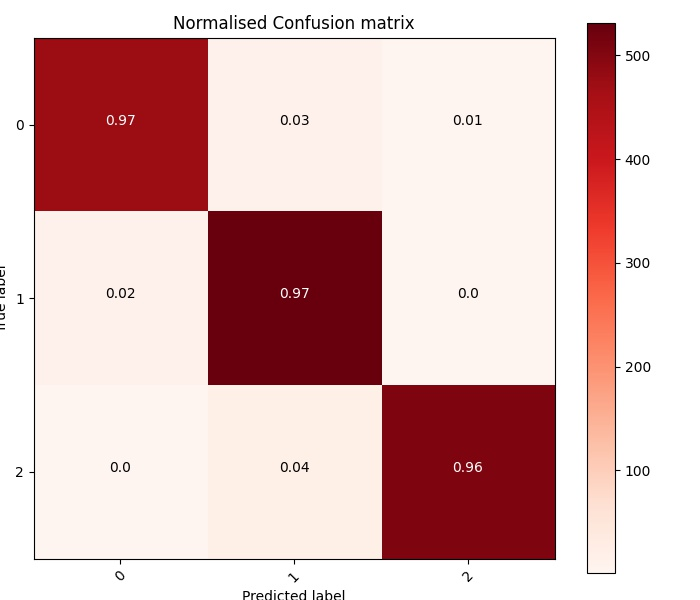

# Radiology-AI

Project 3: Train and Deploy a Radiology AI.

We have a Dataset who contains 3 folders, namely:
Covid: This folder contains lung x-ray images with covid-19 disease
Pneumonia: This folder contains lung x-ray images with pneumonia disease
Normal: This folder contains normal functioning and healthy lung x-ray images

We need an Image classifier to input image and return normal or name of disease, 
classes (Covid, Pneumonia, Normal)
### Data
I split data in 3 sets
- Train 11290 images belonging to 3 classes.
- Validation 3215 images belonging to 3 classes.
- Test 1563 images belonging to 3 classes.

| Normal Image  |  Covid Image | Pneumonia Image  |
|---|---|---|
|   |   |   |

### preprocessing and data augmentation. 
for preprocessing Pixels be normalized between 0 and 1 and images are resized to Width=224 and Height=224.
for data augmentation, I do a horizontal flip.

### Model
For model selection, I select Inception-ResNet v2 architecture pre-trained on ImageNet.
and activation softmax, for last layer connect a dense layer softmax activation.

### Optimizer
Optimizer that implements the [RMSprop](https://towardsdatascience.com/understanding-rmsprop-faster-neural-network-learning-62e116fcf29a) algorithm, settled:

learning_rate `0.0001` and decay `1e-6`, loss `binary_crossentropy`

### Training step
For training set 10 epochs monitoring loss = binary_crossentropy and accuracy, for each set training and loss.

### Test
Last step. select test data, pass across trained model and get confusion matrix and normalized confusion matrix, for final evaluation.

### Note
Complete experiment.
https://colab.research.google.com/drive/1umtqBnZKEdaJ5yVM2AsSmDVER5Ve1oNd?usp=sharing
external test results.

